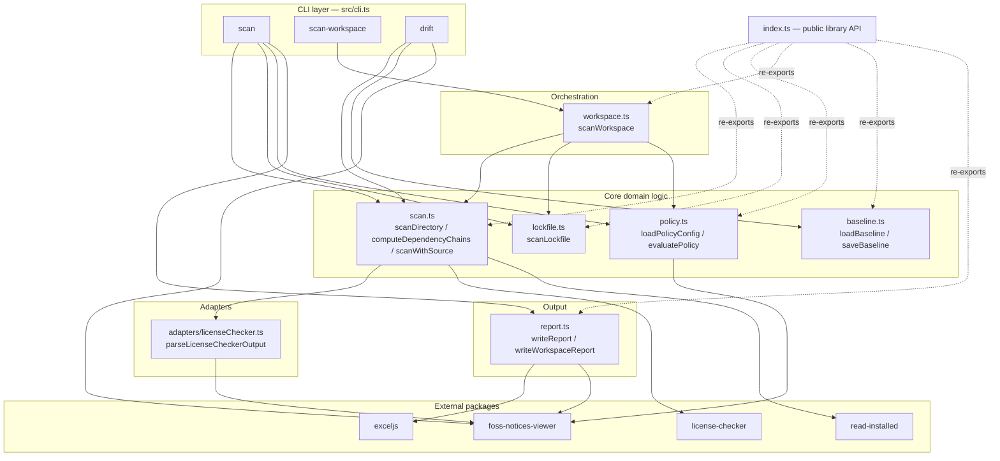
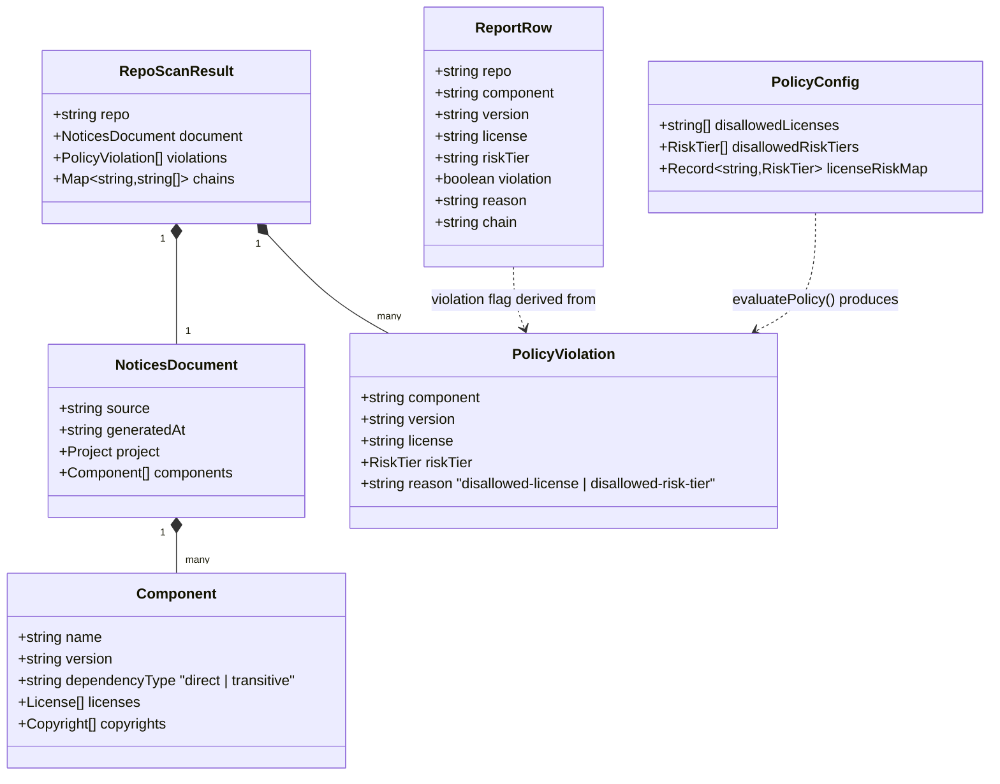
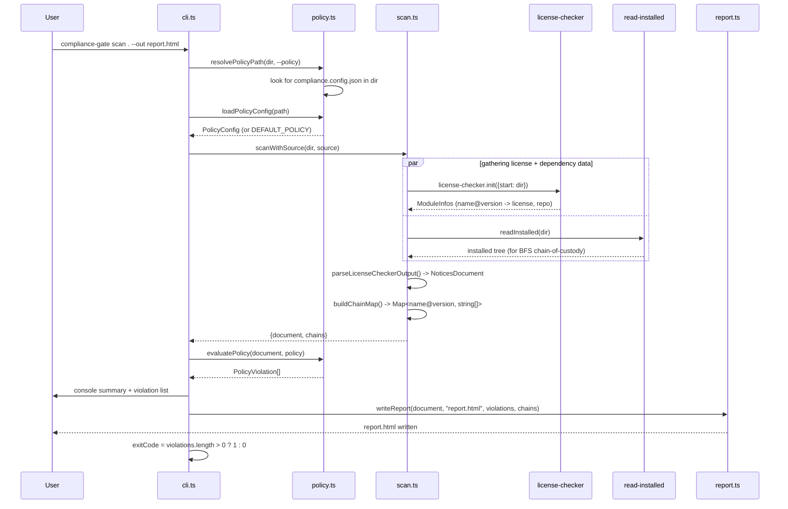
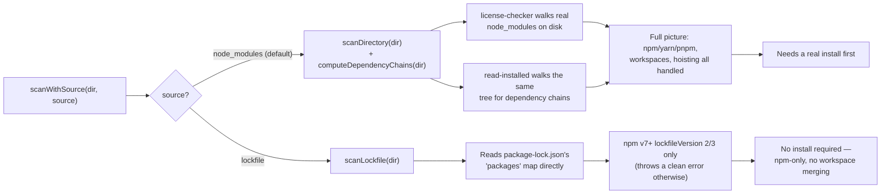
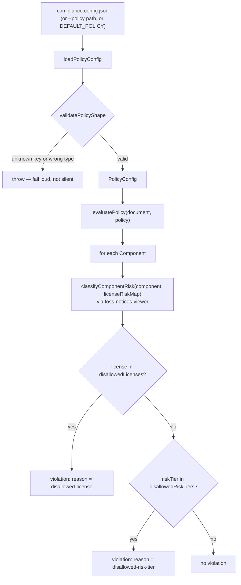
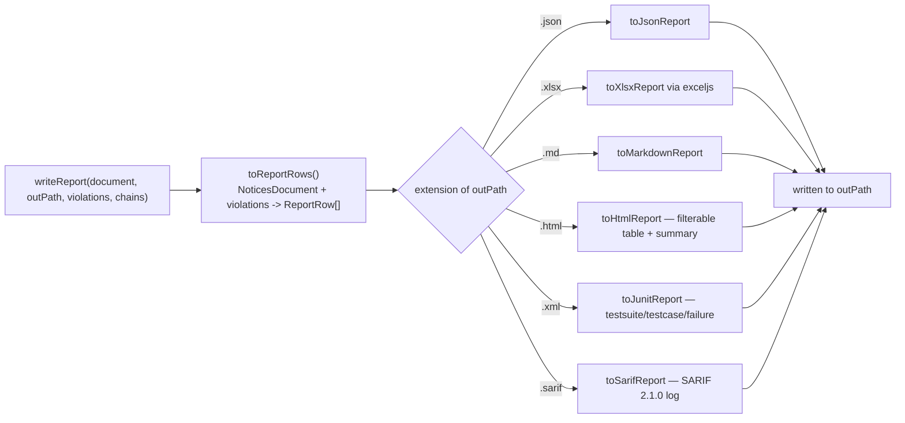
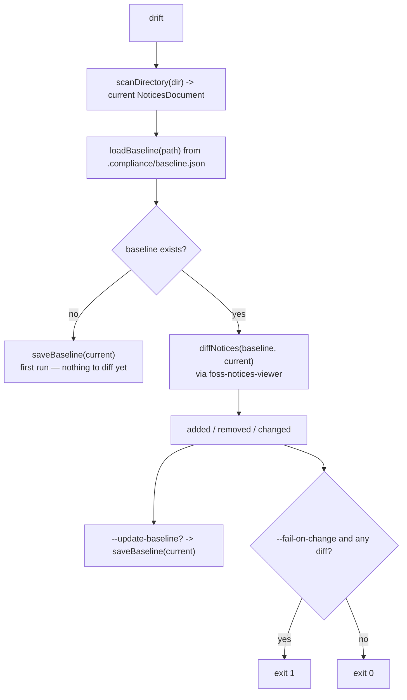
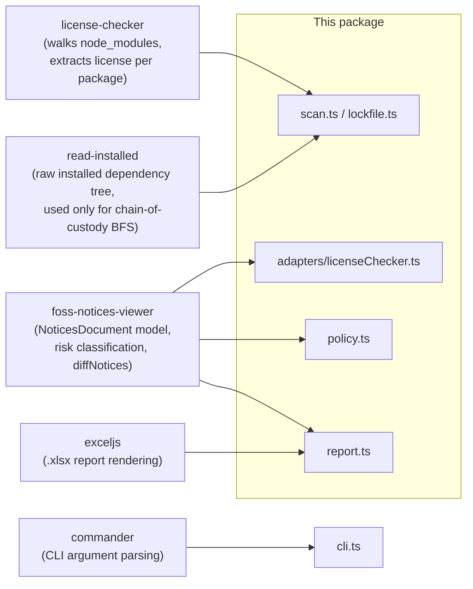
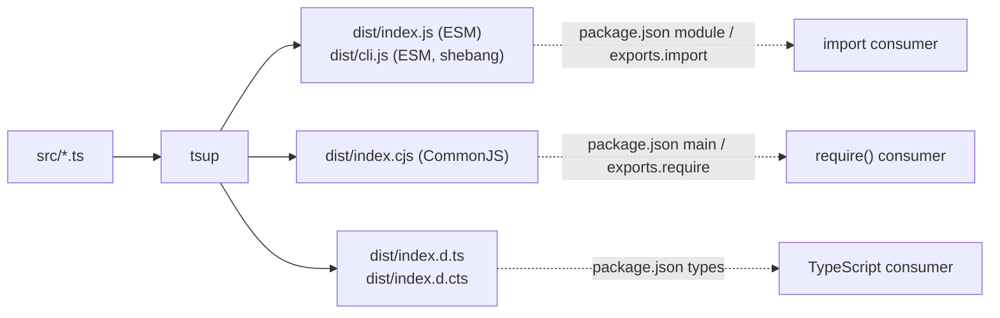
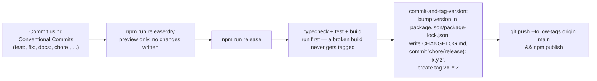

# Architecture

This document describes how `license-compliance-gate` is put together: the
solution structure, the data model, and the runtime flow through each CLI
command. It's a map for anyone extending the tool, not user-facing usage docs
— for how to run it, see the root [README](../README.md).

## Table of contents

- [Solution structure](#solution-structure)
- [Layered architecture](#layered-architecture)
- [Data model](#data-model)
- [Scan flow — `scan`](#scan-flow--scan)
- [Scan sources: node_modules vs lockfile](#scan-sources-node_modules-vs-lockfile)
- [Policy evaluation](#policy-evaluation)
- [Report generation](#report-generation)
- [Workspace scan — `scan-workspace`](#workspace-scan--scan-workspace)
- [Drift detection — `drift`](#drift-detection--drift)
- [External dependencies](#external-dependencies)
- [Build output](#build-output)
- [Building the package](#building-the-package)
- [Release process — commits, tags, changelogs](#release-process--commits-tags-changelogs)
- [Publication readiness checklist](#publication-readiness-checklist)

## Solution structure

```text
license-compliance-gate/
├── src/
│   ├── cli.ts                 # Commander entrypoint — 4 subcommands, all wiring lives here
│   ├── index.ts                # Public library API — re-exports for programmatic use
│   ├── types.ts                 # PolicyConfig, PolicyViolation, RepoScanResult, ScanSource
│   ├── scan.ts                  # node_modules scanning: license-checker + read-installed
│   ├── lockfile.ts               # package-lock.json-only scanning (no install required)
│   ├── policy.ts                 # Policy loading, validation, and evaluation
│   ├── workspace.ts               # Multi-repo scan orchestration
│   ├── baseline.ts                 # Save/load a snapshot for drift detection
│   ├── report.ts                    # Render scan results to json/xlsx/md/html/sarif/junit
│   ├── adapters/
│   │   └── licenseChecker.ts         # license-checker output -> NoticesDocument
│   └── types/
│       └── read-installed.d.ts        # Hand-written types (no @types package exists)
├── test/                         # Vitest — one file per src module, same name
├── docs/
│   └── ARCHITECTURE.md            # This file
├── compliance.config.json          # This repo's own policy (dogfooding)
├── tsup.config.ts                    # Dual ESM+CJS build config
└── package.json
```

**One file, one concern.** There's no `services/`, `controllers/`, or
`utils/` grab-bag — each module name is the noun it owns (`policy.ts` owns
policy loading and evaluation, `report.ts` owns every output format). `cli.ts`
is the only file that knows about Commander; every other module is plain
async functions that take and return data, which is what makes them usable
as a library (`index.ts`) and testable without spawning a subprocess.

## Layered architecture



`cli.ts` never talks to `license-checker` or `foss-notices-viewer` directly —
it only calls the domain modules, which is what makes those same modules
reusable from `index.ts` as a library without any CLI-specific code leaking
through.

## Data model

Everything downstream (policy evaluation, every report format) operates on
one shared shape: `NoticesDocument` (from `foss-notices-viewer`) plus this
package's own `PolicyViolation` and `RepoScanResult`.



`ReportRow.violation` is the single source of truth for pass/fail in every
report format — JSON, HTML, Markdown, XLSX, JUnit's `<failure>`, and SARIF's
`results[]` all key off the same boolean, never re-derived independently
per-format. See [Report generation](#report-generation).

## Scan flow — `scan`



## Scan sources: node_modules vs lockfile

`scanWithSource()` in `scan.ts` is the single fork point both `scan` and
`scan-workspace` go through — neither command implements source-switching
itself, so they can never disagree about what `--source` means.



Trade-off, by design: `node_modules` is the accurate default (real install,
real workspace resolution) and `lockfile` is the fast/no-install path for CI
gates that don't want to pay for a full `npm install` just to check licenses
— at the cost of being npm-only with no workspace support.

## Policy evaluation



A malformed policy file throws immediately instead of silently falling back
to defaults — a config that looks customized but silently isn't is a worse
failure mode than one that refuses to load.

## Report generation

`writeReport`/`writeWorkspaceReport` dispatch purely on the `--out` file
extension — one entry point, six renderers, no format-specific branching
anywhere else in the codebase.



`scan-workspace` mirrors this exactly through `writeWorkspaceReport`, using
the `*WorkspaceReport` variant of each renderer (`toJsonWorkspaceReport`,
`toSarifWorkspaceReport`, ...) — same six formats, one `WorkspaceReport`
(multiple repos' `ReportRow[]` plus a combined summary) instead of one
repo's rows.

SARIF anchors every result at `package.json:1` (there's no natural source
line for "this license is disallowed") and only emits violations, not a full
inventory — matching what a CI annotation actually needs. JUnit emits one
`<testcase>` per component with a `<failure>` only on the violating ones, so
a CI's test-results view shows exactly which packages failed the gate.

## Workspace scan — `scan-workspace`

```mermaid
sequenceDiagram
    participant User
    participant CLI as cli.ts
    participant WS as workspace.ts
    participant Policy as policy.ts
    participant Scan as scan.ts / lockfile.ts
    participant Report as report.ts

    User->>CLI: scan-workspace repoA repoB repoC --out consolidated.sarif
    CLI->>WS: scanWorkspace([repoA, repoB, repoC], policyPath, source)
    loop for each repo
        WS->>Policy: resolvePolicyPath(repo, explicitPolicyPath)
        Note right of Policy: explicit --policy wins;<br/>otherwise each repo's own<br/>compliance.config.json if present
        WS->>Policy: loadPolicyConfig(path)
        WS->>Scan: scanWithSource(repo, source)
        Scan-->>WS: {document, chains}
        WS->>Policy: evaluatePolicy(document, policy)
        Policy-->>WS: violations
        WS->>WS: push RepoScanResult{repo, document, violations, chains}
    end
    WS-->>CLI: RepoScanResult[]
    CLI->>Report: writeWorkspaceReport(results, "consolidated.sarif")
    Report-->>User: consolidated.sarif written
    CLI->>CLI: exitCode = 1 if any repo has violations
```

Each repo is gated by its **own** policy file by default (per-repo
`compliance.config.json`), not one policy forced across every repo — the
same resolution `scan` uses standalone, so a repo scanned on its own and the
same repo scanned as part of a workspace are gated identically. An explicit
`--policy` overrides this and applies to every repo uniformly.

## Drift detection — `drift`



This is the only command that persists state between runs
(`.compliance/baseline.json`) — every other command is a pure
scan-in/report-out with no memory of previous invocations.

## External dependencies



`license-checker` and `read-installed` are the only two packages that ever
touch the filesystem's `node_modules`/lockfile directly — everything else in
this package works against the normalized `NoticesDocument`/`ReportRow`
shapes, which is what keeps `--source lockfile` a small addition
(`lockfile.ts` only had to produce the same `NoticesDocument` shape, nothing
downstream needed to change).

## Build output

`tsup.config.ts` builds both module formats from the same source in one
pass — there's exactly one `src/`, not a parallel CJS source tree:



`package.json`'s `"files": ["dist"]` is the sole publish allowlist — `src/`,
`test/`, and this `docs/` folder never ship in the npm tarball (see
`.npmignore` for the explicit list, kept as a second, redundant guard).

## Building the package

```bash
npm install       # dependencies
npm run typecheck  # tsc --noEmit — no dist output, just type errors
npm test            # node --test against test/**/*.test.ts (vitest-style assertions, no vitest dependency)
npm run build         # tsup — emits dist/index.{js,cjs,d.ts,d.cts} + dist/cli.js
```

`npm run build` is the only command that touches `dist/`. Always run
`typecheck` and `test` before it — `tsup` transpiles but doesn't type-check,
so a type error can otherwise ship silently into the built output.

To sanity-check what a real `npm publish` would actually ship, without
publishing:

```bash
npm pack --dry-run   # lists every file in the tarball + final size
```

Current output should be exactly 7 files (`dist/index.js`, `dist/index.cjs`,
`dist/index.d.ts`, `dist/index.d.cts`, `dist/cli.js`, `package.json`,
`README.md`) at ~41 kB. If that list grows, something leaked past
`"files": ["dist"]`/`.npmignore` — check what changed before publishing.

`npm run demo` is a smoke test, not part of the publish flow: it builds,
scans this repo itself, and prints the JSON report — a fast way to confirm
the CLI still works end-to-end after a change, without needing a second repo
to scan.

## Release process — commits, tags, changelogs

The repo is git-initialized, with an initial commit tagged `v0.1.0` as the
baseline every future release is diffed against. Versioning, `CHANGELOG.md`,
and git tags are handled by
[`commit-and-tag-version`](https://github.com/absolute-version/commit-and-tag-version)
(a devDependency, maintained successor to the archived `standard-version`) —
not by hand.



### Commit message convention

Every commit's *type* prefix determines what happens on the next release —
this is what lets a changelog generate itself instead of being written by
hand:

| Prefix | Effect on next release |
|---|---|
| `fix: ...` | Patch bump (`0.1.0` → `0.1.1`), listed under "Bug Fixes" |
| `feat: ...` | Minor bump (`0.1.0` → `0.2.0`), listed under "Features" |
| `feat!: ...` or a `BREAKING CHANGE:` footer | Major bump (`0.1.0` → `1.0.0`) |
| `docs:`, `chore:`, `refactor:`, `test:`, `perf:`, `style:` | No version bump; `perf`/`refactor` still appear in the changelog, the rest don't |

A commit that doesn't follow this format still commits fine — it's just
invisible to the release tool (no changelog entry, doesn't influence the
version bump).

### Cutting a release

```bash
npm run release:dry   # preview: shows the version bump + changelog, writes nothing
npm run release         # bumps version, writes CHANGELOG.md, commits, tags vX.Y.Z
git push --follow-tags origin main
npm publish
```

`npm run release:dry` was run against this repo's own initial commit to
verify the whole pipeline end-to-end before this section was written — it
correctly typechecked, tested, built, computed a `0.1.1` patch bump, and
generated a `CHANGELOG.md` preview, then left the working tree untouched
(dry-run mode writes nothing to disk).

### Known gap: changelog compare links

`package.json` has no `repository` field yet (see the
[checklist](#publication-readiness-checklist) below), so the changelog's
`[x.y.z](.../compare/vA...vB)` links currently render as broken relative
URLs (`///compare/...`) instead of pointing at a real GitHub/GitLab compare
view. Add a `repository.url` once this repo has a real remote — the tool
picks it up automatically, no other config needed.

## Publication readiness checklist

The code, build, and tests are already publish-grade (55/55 tests passing,
clean dual ESM/CJS build, lean tarball). What's left is publishing hygiene —
none of it touches source code:

1. **Add a `LICENSE` file.** `package.json` declares `"license": "MIT"` but
   no `LICENSE` file exists on disk — `npm pack --dry-run` confirms it's
   absent from the tarball. Needs a real copyright holder name; generate it
   from the standard MIT template once you have one.
2. ~~**Initialize git.**~~ Done — the repo now has an initial commit tagged
   `v0.1.0` as the release baseline (see
   [Release process](#release-process--commits-tags-changelogs)). Still
   needed: push to a real remote (GitHub/GitLab/Azure DevOps) once one
   exists — a `repository` field in `package.json` (next step) needs that
   URL to point at, and until then changelog compare links render broken.
3. **Fill in missing `package.json` metadata**: `repository`, `author`,
   `keywords` (drives npm search discoverability — currently missing
   entirely), `homepage`, `bugs`. None of these are functional; all of them
   affect how the package looks and is found once published.
4. **Decide on a CI workflow** (GitHub Actions or Azure DevOps) that runs
   `npm run typecheck && npm test && npm run build` on every push/PR. Not
   required for `npm publish` to succeed, but running this repeatedly by
   hand instead of in CI is the kind of thing that gets skipped under
   deadline pressure — see [Report generation](#report-generation) for the
   SARIF/JUnit output this tool already produces for exactly that CI use
   case.
5. **Bump past `0.1.0`** once the above are done — `0.x` signals
   "pre-stable" to anyone evaluating whether to depend on it; a `1.0.0` tag
   is a public commitment to the CLI flags and library API documented in the
   README not breaking without a major version bump.

None of this is a code change — it's the difference between "works when I
run it" (already true today, see the CJS/ESM/CLI verification in the root
README) and "safe for a stranger to `npm install` and depend on."
